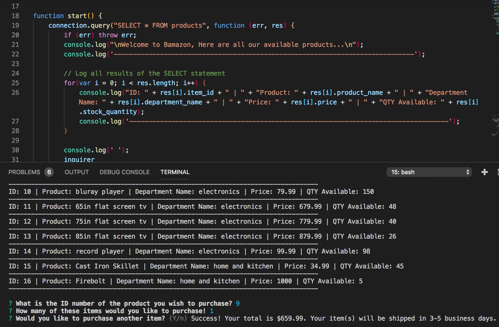
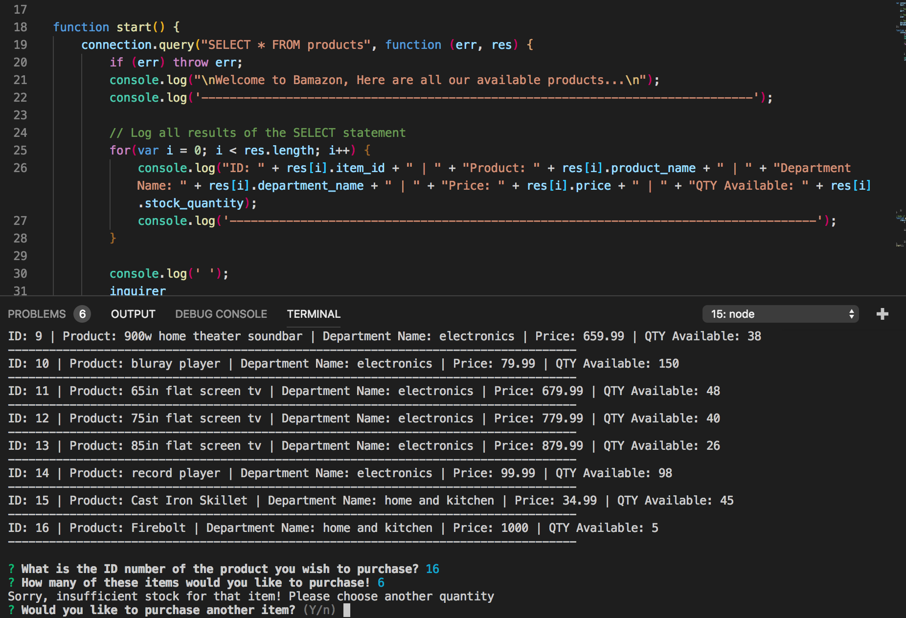
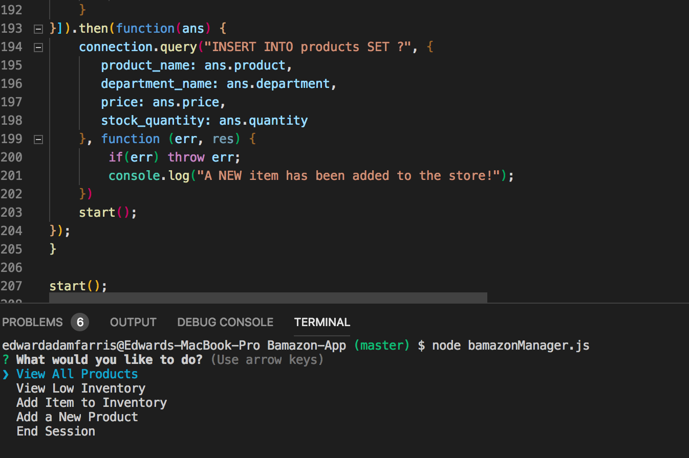
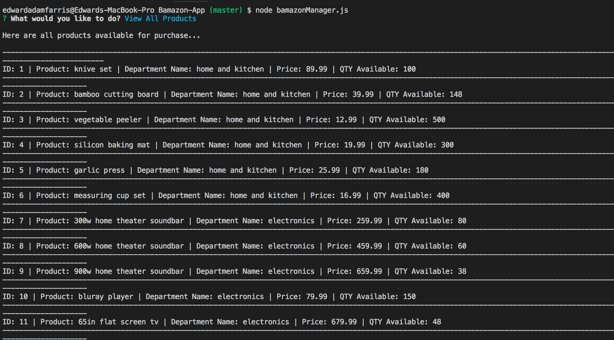
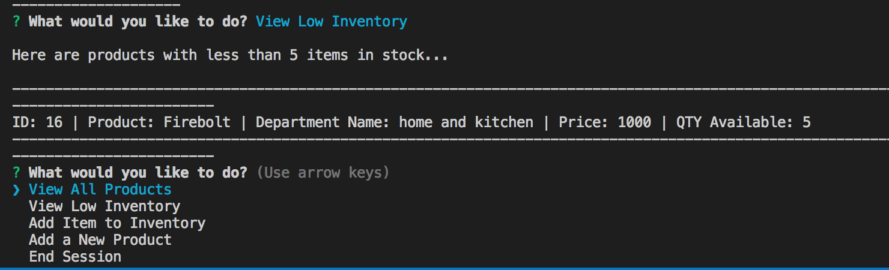
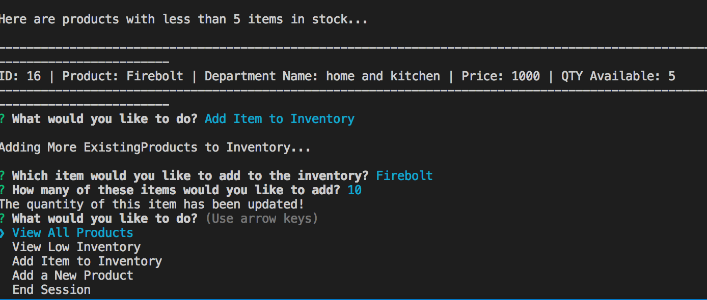
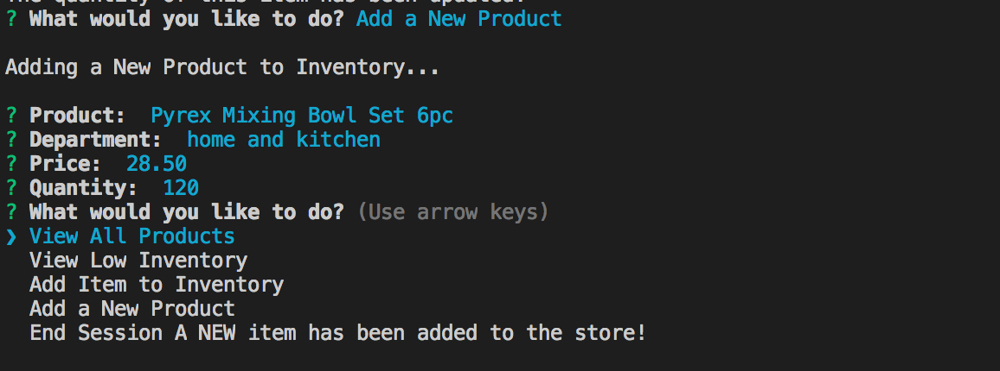

# Bamazon-App
### **Description:**
A Node app similar to amazon in the way of browsing available inventory and selecting products for purchase through the command line. Users can specify a certain quantity of a product, unless that value is greater than the quantity in stock. Once a purchase is made, the datatable is updated to reflect the new quantity, and informs the user of their total cost. The manager app allows updates to be made in the product database. Items can be viewed, existing items can be replenished or stocked, new products can be added, and products with low inventory can be easily identified 
_____
### **Before You Begin**
* Open Terminal or Gitbash
* Clone Repo
* within the directory of the repo, install Node packages:
    * npm install mysql (https://www.npmjs.com/package/inquirer)
    * npm install inquirer (https://www.npmjs.com/package/inquirer) 
_____
### **How to Run the Apps**
1. open file directory in the terminal or Gitbash
2. type the following in the command line:  **node filename** 
    * Filename will either be:
        * *bamazonCustomer.js* if you wish to shop as a customer.
        * *bamazonManager.js* if you wish to modify the inventory as a manager.
3. Follow the prompts that are returned using the arrow keys and the return button. 
_____
### **What the Apps Do**
1. **bamazonCustomer.js:** 
When this application is run through the terminal command line, it will do the following:
* Prints all available items from the store along with other information including the price, quantity, and department.
* Prompts the customer to choose an item to purchase by entering the item's unique ID number.
* Then prompts the customer to enter a valid quantity of the item if they want more than one.
    * If there is enough of the item in stock, it will display the total cost to the customer.
    * If there is NOT enough of the item in stock, it will inform the customer of this.
    * If the purchase went through, the stock-quantity is immediately updated in the database to reflect the purchase.
    * It also updates the total sales in the departments table. 
_____
2. **bamazonManager.js**
When this application is run through the terminal command line, it will provide a menu of commands that allow the manager to do the following:
* **View All Products:** Displays all available items from the store along with other information including the price, quantity, and department.
* **View Low Inventory:** Displays any products that have a quantity of 5 or less in stock.
    * These items will ONLY display when quantity reaches 5 or less, if no items are shown, all items quantity is greater than 5.
* **Add Item to Inventory:** Allows the manager to add more of any existing item(s) to the inventory and updates the product database. Prompts will ask user for product name and then how many they wish to add.
* **Add a New Product:** Allows the manager to add a completely NEW product that did not exist before. Prompts will guide the user in adding all relevant information including the product name, price, quantity, and department name.
* **End Session:**Allows user to exit the program 
_____
### **Demo Screenshots**
##### bamazonCustomer.js 
* As a customer, users may view all products and make a purchase!

* The app will not allow customers to purchase more items than the store has in stock!

_____
##### bamazonManager.js 
* As a manager, users may make selections from a menu prompt!

* Managers may view all products!

* They may also choose to see ONLY items that are "low inventory" (5 or less items).

* Managers may add or replenish the stock of existing items in the inventory database!

* They may also add NEW products to the inventory database including all relevant information pertaining to the item.

_________
### **Technologies Used**
* Node.js
* MySQL 
* JavaScript
* Inquirer NPM package (https://www.npmjs.com/package/inquirer)
* mysql NPM package (https://www.npmjs.com/package/mysql) 
_____
### **Built With**
* Visual Studio Code
* MySQL Workbench
* Terminal/Gitbash

